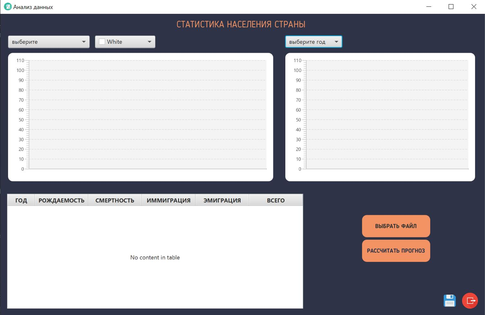
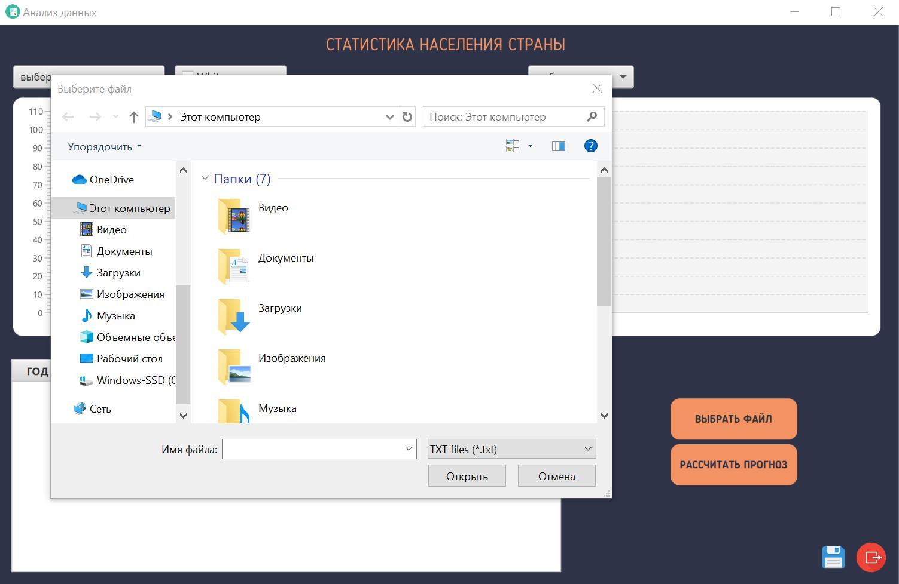
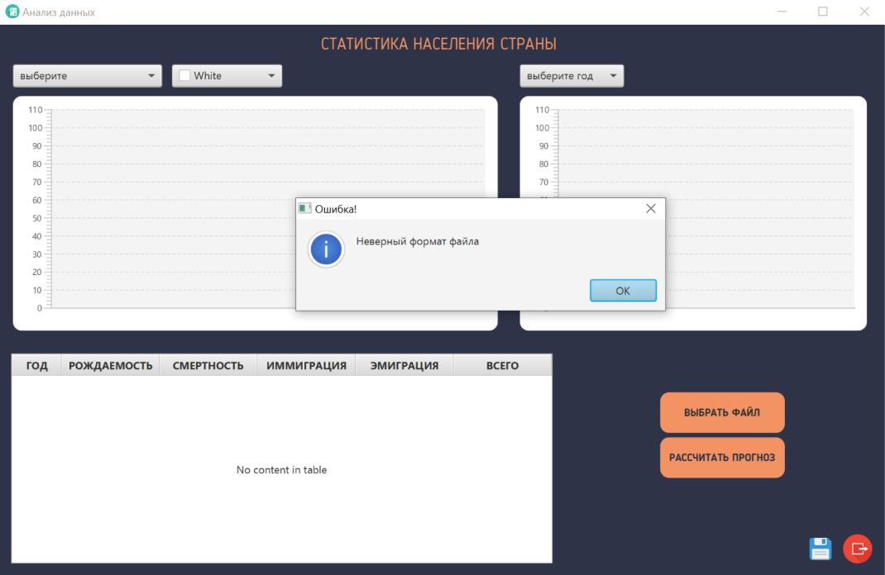
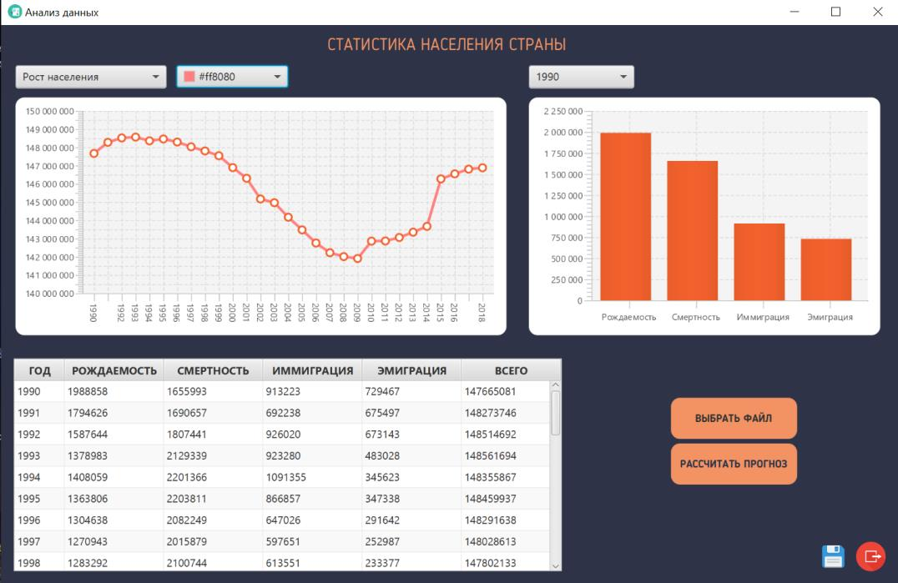
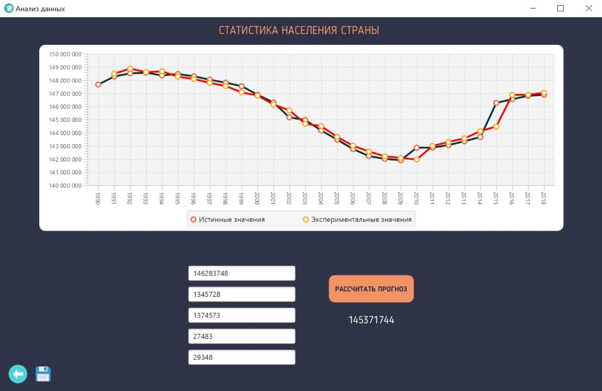

# Analysis of the country population
### Задание: Изучить технологию JavaFX, создать рабочий прототип пользовательского интерфейса, выбрать и сформировать структуру базы данных, разработать и реализовать расчет параметров статистической модели. Обеспечить работу графического пользовательского интерфейса и сохранение данных и результатов в базе данных.

 

Чтобы зарегистрироваться пользователь должен придумать свой уникальный логин и пароль, содержащий не менее 6 символом. Если условия не выполнены, пользователь видит соответствующие сообщения.

 

При успешной авторизации пользователь заходит в главное меню.

Данные загружаются в формате txt. При нажатии кнопки «Выбрать файл» выходит диалоговое окно с выбором файла.

Если пользователь указывает файл, не соответствующий нашему формату, всплывает окно об ошибке.

При успешной загрузке файла, данные отображаются в виде таблицы и графиков.

Далее пользователь может составить прогноз, нажав на кнопку «Рассчитать прогноз» после чего выходит окно с графиком модели прогнозирования.

Предусмотрены такие кнопки как «Выход», отвечающая за выход из аккаунта пользователя, «Назад», возвращающая пользователя к главному меню, и кнопка «Сохранить», сохраняющая прогноз пользователя.

